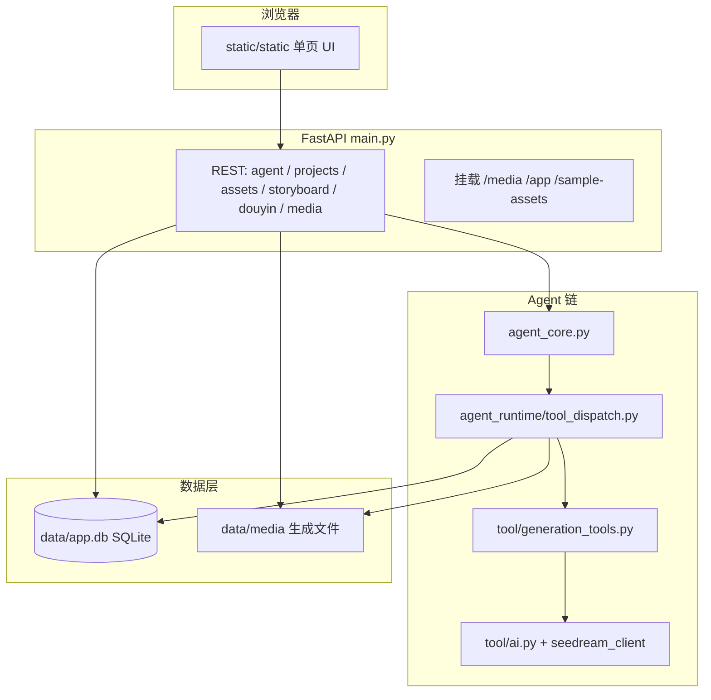

# FrameOS

面向「项目素材 + Agent 对话 + 分镜/视频生成」的单体应用：**FastAPI** 提供 REST 与静态前端，**SQLite** 存聊天记录与素材索引，**Anthropic Messages API** 驱动带工具的 Agent，生图/生视频走 **火山方舟（Seedream / Seedance）** 与可选 **DashScope 万相**。

---

## 快速启动

1. Python 3.11+，创建虚拟环境并安装依赖：`pip install -r requirements.txt`
2. 复制并填写 `.env`（至少需要 `ANTHROPIC_API_KEY`、`MODEL_ID`；生图/视频另需方舟与/或 DashScope 相关变量，见下文「环境变量」）
3. 启动：
   - `serve.bat`：本机 `127.0.0.1:8000`，带 `--reload`
   - `serve-lan.bat`：`0.0.0.0:8000`，局域网可访问，`--reload-exclude data` 避免数据库触发不停重启
   - `serve-stable.bat`：无热重载，适合长时间跑任务
4. 浏览器打开 **`http://127.0.0.1:8000/app/`**（根路径 `/` 会重定向到 `/app/`）
5. 探活：`GET /api/health`

---

## 总体架构



- **前端**：`static/static/` 下 HTML/CSS/JS，入口 `js/main.js` → `app/workflow-ui.js`，通过 `js/api/*.js` 调后端。
- **后端中枢**：`main.py` 注册路由、启动时 `init_db()`、同步公共产品图、挂载静态目录。
- **Agent**：`agent_core.py` 调 Claude + `TOOLS`；工具结果在 `tool_dispatch.py` 里执行并写库。
- **生成**：`tool/generation_tools.py` 编排 prompt、调用 `LocalWanArkHub`；底层为 `tool/ai.py`、`tool/seedream_client.py` 等。

---

## 目录与文件职责

### 根目录

| 路径 | 作用 |
|------|------|
| `main.py` | **应用入口**：FastAPI 应用、全部 HTTP 路由、静态挂载、与 Agent/分镜/抖音/素材 CRUD 的胶水层。 |
| `agent_core.py` | **Claude 循环**：`sys.path` 注入 `tool/`、`agent_loop`、`extract_last_assistant_text`；导入 `tools_spec`、`tool_dispatch`。 |
| `runtime_ctx.py` | **请求内上下文**：`ContextVar`（当前 `project_id`、视频引用栈、分镜 URI、待镜像分镜等），供 `main` 与 `tool_dispatch` 同线程读写。 |
| `requirements.txt` | Python 依赖锁定（FastAPI、Anthropic、DashScope、volcengine Ark、Pillow、httpx 等）。 |
| `serve.bat` / `serve-lan.bat` / `serve-stable.bat` | Windows 下用 uvicorn 启动的便捷脚本。 |
| `.env` | 本地密钥与模型 ID（不入库示例，自行维护）。 |

### `agent_runtime/`（Agent 与业务编排，**强依赖** `main` / `agent_core` / `tool`）

| 文件 | 作用 |
|------|------|
| `tools_spec.py` | **非常重要**：Claude 的 `system` 文案与 `tools` JSON Schema；与 `tool_dispatch` 中的工具名必须一致。 |
| `tool_dispatch.py` | **非常重要**：解析助手消息里的 `tool_use`，调用 `run_generate_image` / `run_generate_video`，`persist_*`，维护分镜首帧纠偏、双引用必须先分镜、分镜镜像入素材库时机等。 |
| `persist.py` | 将生图/生视频 JSON 结果写入 `project_assets`（分镜库 / 素材库 / 视频库）。 |
| `media_hub.py` | 媒体根路径、Hub 构造，与 `tool/ai` 的本地路径解析一致。 |
| `reply_policy.py` | 助手回复后处理、`tool_trace` 抽取（供前端「生成追溯」）。 |
| `chat_augment.py` | 用户极短句与历史长句拼接，便于模型理解「角色库/分镜库」等续指。 |
| `messages.py` | 从消息列表取最后助手文本、去掉 Markdown 图片等。 |
| `abstract_agent_mode.py` | `agent_mode=abstract` 时的导演 persona 与 session 锁文案。 |
| `douyin_service.py` | 抖音分享解析入库编排，内部用 `tool/douyin_core.py`。 |
| `storyboard_run.py` | HTTP「分镜流水线」长任务：读上传、调 `demo/storyboard_pipeline` 能力（与 Web UI 分镜 Tab 相关）。 |
| `storyboard_video_run.py` | 分镜成片视频导出类编排（与对应 stream API 相关）。 |
| `media_thumbnail.py` | `/api/assets/thumbnail/` 等缩略图生成。 |

### `tool/`（生成实现；**被 `agent_core` 通过 `sys.path` 以顶层模块方式引用**）

| 文件 | 作用 |
|------|------|
| `generation_tools.py` | **非常重要**：`run_generate_image` / `run_generate_video`、prompt 分层、Seedream/Wan 分支、与 Hub 对接。 |
| `ai.py` | 方舟视频任务构造、首帧 URL 规范化、多参考与 Seedance 策略等。 |
| `seedream_client.py` | 火山方舟 Seedream 同步生图 HTTP 客户端。 |
| `douyin_core.py` | 抖音分享文本解析、无头拉取逻辑（供 `douyin_service` 使用）。 |

> 注意：`tool/` 内部分文件使用 `from ai import ...` 形式，因此 **`agent_core.py` 必须把 `tool` 目录插入 `sys.path` 且先于 `generation_tools` 导入**，否则会导入失败。

### `data/`

| 文件 | 作用 |
|------|------|
| `db.py` | **核心数据**：SQLite 路径、`chat_messages` / `project_assets`、会话与素材 CRUD、Agent 引用素材解析。 |
| `media_mirror.py` | 将远端图 URL 镜像到 `data/media/<project>/`，供持久化与本地首帧。 |
| `product_catalog_sync.py` | 启动时把仓库 `产品图/` 同步到 `data/media/_product_catalog/` 并写入共享项目素材行。 |

### `static/static/`（前端）

| 路径 | 作用 |
|------|------|
| `index.html` | 单页骨架与内联入口脚本引用。 |
| `js/main.js` | 前端入口：`mountFrameOS()`。 |
| `js/app/workflow-ui.js` | **主 UI**：项目树、素材栅格、Agent 聊天、分镜与引用 chips、与 API 的绝大部分交互。 |
| `js/config.js` | `API_BASE_URL` 等前端配置。 |
| `js/api/*.js` | 按域封装的 `fetch`（`agent.js`、`projects.js`、`storyboard.js`、`douyin.js` 等）。 |
| `js/state/store.js` | 轻量全局状态默认值。 |
| `js/utils/helpers.js` | `escHtml` 等工具函数。 |
| `css/workflow.css` | 全局样式。 |

### `demo/`（**可独立运行的 CLI / 库**）

| 文件 | 作用 |
|------|------|
| `storyboard_pipeline.py` | **大型流水线**：产品分析 → 剧本 → 分镜 JSON → 万相逐镜出图 → 导出 Markdown；被 `agent_runtime/storyboard_run.py` 与 `demo/agent.py` 使用。 |
| `wan_image_client.py` | 可脚本化调用的万相生图封装（环境变量见文件头注释）。 |
| `agent.py` | **独立 CLI Agent**：只挂载 `storyboard_pipeline` 相关工具，工作目录为当前 cwd；**不经过** `main.py`。 |

### 其它

| 路径 | 作用 |
|------|------|
| `产品图/` | 公共产品摄影图源；启动时同步到 `_product_catalog` 媒体目录。 |

---

## 依赖关系（强耦合简图）

```
main.py
  ├── data.db, data.media_mirror, data.product_catalog_sync
  ├── agent_core.agent_loop
  ├── agent_runtime.*（chat_augment, reply_policy, storyboard_run, …）
  └── tool（间接：仅当 Agent 调工具时，经 agent_core → tool_dispatch）

agent_core.py
  ├── anthropic, httpx
  ├── agent_runtime.tools_spec (SYSTEM, TOOLS)
  ├── agent_runtime.tool_dispatch.collect_tool_results
  └── agent_runtime.messages / abstract_agent_mode

agent_runtime/tool_dispatch.py
  ├── tool.generation_tools (run_generate_image, run_generate_video)
  ├── agent_runtime.persist
  ├── runtime_ctx（ContextVar）
  └── data.media_mirror（镜像 URL）

tool/generation_tools.py
  ├── tool/ai.py, tool/seedream_client.py（经 Hub 与 Ark/DashScope）
  └── LocalWanArkHub（同文件内）

static → 仅依赖 HTTP API，不直接 import Python。
```

**最重要、改动需格外谨慎的文件**

1. `main.py` — 路由与启动顺序；改坏则全站不可用。  
2. `agent_core.py` — `sys.path` 与 Agent 循环；改坏则工具链/导入崩溃。  
3. `agent_runtime/tools_spec.py` + `agent_runtime/tool_dispatch.py` — 工具名、参数、执行逻辑必须对齐。  
4. `tool/generation_tools.py` — 所有生图/生视频 prompt 与 API 编排。  
5. `data/db.py` — 表结构与素材/会话语义。  
6. `static/static/js/app/workflow-ui.js` — 主界面与 Agent 交互。

---

## 可独立运行的模块

以下可在**单独终端、配置好对应 `.env`**后运行，**不启动** `main.py`：

| 模块 | 方式 | 说明 |
|------|------|------|
| `demo/agent.py` | `cd demo && python agent.py`（示例；以仓库说明为准） | 仅「分镜流水线 + Claude 工具」CLI，依赖 `storyboard_pipeline`、Anthropic、DashScope 等。 |
| `demo/wan_image_client.py` | 作为 **Python 模块**被 `storyboard_pipeline` 等 import；可另写小脚本调用其中函数 | 万相生图封装；需 `DASHSCOPE_API_KEY` 等（见文件头注释）。 |
| `demo/storyboard_pipeline.py` | 被其它脚本 import，或通过 `demo/agent` 工具入口驱动 | 自身可配合环境变量做一键分镜；体积大、依赖 LLM + 万相。 |

**不能**脱离后端单独「完整使用」的部分：  
`static/static` 下的 UI 需要 `main.py` 提供 API 与同源的 `/media` 静态文件。

---

## 主要 HTTP API（`main.py`）

| 方法 | 路径 | 用途 |
|------|------|------|
| GET | `/api/health` | 健康检查 |
| POST | `/api/agent/chat` | Agent 对话（可选 `referenced_asset_ids`） |
| GET | `/api/agent/chat-project-ids` | 有会话的 project_id 列表 |
| GET/DELETE | `/api/agent/sessions/{project_id}/messages`、DELETE session | 聊天记录 |
| DELETE | `/api/projects/{project_id}` | 删项目数据 |
| POST/GET/DELETE | `/api/projects/{project_id}/assets` | 素材上传与列表、删条目 |
| GET | `/api/assets/thumbnail/`、`/api/assets/file/` | 缩略图与受控文件读取 |
| POST | `/api/douyin/fetch` | 抖音分享链接拉视频入库 |
| POST/GET | `/api/projects/.../storyboard/stream`、`.../runs` | 分镜流水线流式与历史 |
| POST | `/api/projects/.../storyboard/video/stream` | 分镜成片视频相关 |

静态：`/media/` → `data/media`；`/app/` → `static/static`。

---

## 环境变量（按能力分组）

实际键名以 `.env` 与代码为准，常见包括：

- **Agent**：`ANTHROPIC_API_KEY`、`MODEL_ID`；可选 `ANTHROPIC_BASE_URL`、`ANTHROPIC_HTTP_TIMEOUT_SEC`、`AGENT_MAX_TOOL_ROUNDS` 等。  
- **方舟生图（Seedream）**：`ARK_API_KEY`、图像模型 ID 等（见 `seedream_client.py` / `generation_tools.py`）。  
- **方舟视频（Seedance 等）**：视频模型 ID、首帧 role 相关开关（见 `tool/ai.py`）。  
- **万相（DashScope）**：`DASHSCOPE_API_KEY`；`IMAGE_GENERATION_PROVIDER=wan` 时走万相生图。  
- **媒体**：`MEDIA_ROOT`（默认 `data/media`）。

---

## 数据落盘

- **数据库**：默认 `data/app.db`（`DB_PATH`）。  
- **生成文件**：`data/media/<项目段>/...`；公共产品图在 `data/media/_product_catalog/`。  
- 删除项目会删库内行；部分接口会尝试删除本项目目录下对应文件（见 `main._unlink_owned_media_file`）。

---

## 与「Web Agent 分镜」和「demo 分镜流水线」的关系

- **Web 里 Agent 调用的「分镜首帧」**：`generate_storyboard_image` → `tool_dispatch` → `generation_tools.run_generate_image`（Seedream 或 Wan），结果进 **分镜库**，再按当前逻辑在出视频前镜像 **素材库 ·首帧**。  
- **分镜 Tab 长流水线**（脚本级 JSON + 逐镜万相）：主要由 `agent_runtime/storyboard_run.py` 调 `demo/storyboard_pipeline.py`，与上一条链路**并存**，用途不同。

---

## 许可与贡献

内部/私有项目时请自行补充许可证与协作规范；本文档随代码演进如有出入，以源码为准。
